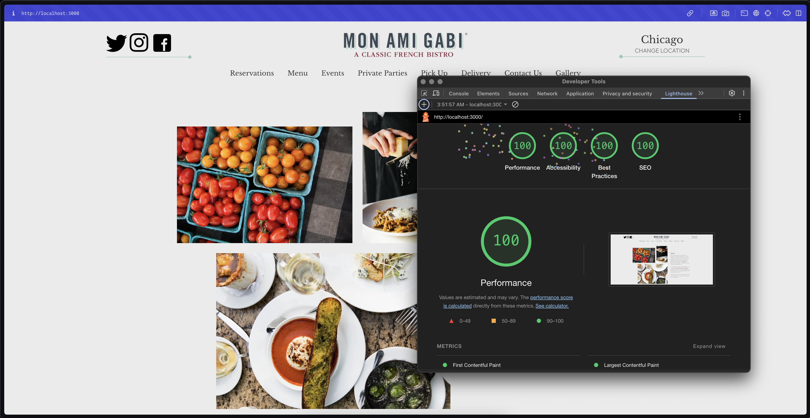

# Lettuce Entertain You - Jr. Web Developer Coding Challenge

This repository contains my submission for the Lettuce Entertain You Jr. Web Developer take-home coding challenge.

The goal of this project was to recreate a section of the Mon Ami Gabi website mockup using React/Next.js, implement specific functionalities (like the reservation form and events section with data fetching and filtering), and meet various technical requirements including responsiveness and accessibility standards.

**Live Demo:**

You can view a live demo of the completed project here: https://lettuce-challenge-hretgxv4t-noel-alfaros-projects.vercel.app/

**Technologies Used:**

- **React:** JavaScript library for building user interfaces.
- **Next.js:** React framework for server-side rendering, routing, and API routes.
- **TypeScript:** Typed superset of JavaScript that compiles to plain JavaScript.
- **Tailwind CSS v4:** Utility-first CSS framework for styling.
- **shadcn/ui:** UI component library built on Tailwind CSS (used for the Sheet component).
- **react-icons:** Icon component library for hamburger menu icon to trigger sheet.
- **tanstack/react-form:** A headless form library for React with built-in validation and state management.
- **tanstack/react-query:** A data-fetching library for React that simplifies fetching, caching, and updating asynchronous data.
- **prettier-plugin-tailwindcss:** Prettier plugin to automatically sort Tailwind CSS classes.
- **date-fns:** Library for date manipulation and formatting.

**Features Implemented:**

- Responsive recreation of the Mon Ami Gabi website section based on the provided mockup.✅
- Implementation of a functional reservation form (logs data to console). ✅
- Dynamic "Upcoming Events" section: ✅
  - Fetches data from the provided JSON endpoint.✅
  - Filters out past events.✅
  - Displays events without dates at the bottom.✅
  - Includes city filtering functionality.✅
- Responsive navigation handling for desktop and mobile using Tailwind and shadcn/ui Sheet. ✅
- Focus on clean code, clear naming conventions, and semantic HTML. ✅
- Effort to meet ADA/WCAG accessibility standards (audited with Lighthouse). ✅
  

**How to Install and Run Locally:**

To get a copy of the project up and running on your local machine for review, follow these steps:

1.  **Clone the Repository:** Clone the forked repository to your local machine using Git:
    ```bash
    git clone https://github.com/noelalfaro/lettuce-challenge.git
    cd lettuce-challenge
    ```
2.  **Install Dependencies:** Install the necessary project dependencies:
    ```bash
    npm install
    ```
3.  **Run the Development Server:** Start the Next.js development server:

    ```bash
    npm run dev

    ```

4.  **Open in Browser:** Open your web browser and navigate to `http://localhost:3000` (or the address shown in your terminal).

---

**Notes on Implementation & Design Choices:**

- For the mobile navigation, I opted to use the shadcn/ui Sheet component to provide a smooth slide-in experience while leveraging its built-in accessibility features.
- I focused on using Tailwind's utility-first approach to style the components, configuring the LEYE color palette and fonts in the theme.
- The reservation form is implemented using TanStack Form, which provides a headless approach to form management, allowing for complete control over the UI while handling form state, validation, and submission.
- The "Upcoming Events" section uses TanStack Query to efficiently fetch, cache, and update event data from the API. This simplifies data management and improves performance.
- Radix UI components were used for creating accessible and unstyled UI elements, such as the Popover for the date picker and the Dialog for event details.
- The `prettier-plugin-tailwindcss` plugin is used to automatically sort Tailwind CSS classes, ensuring consistent styling and readability.

---

Thank you for reviewing my submission!

**Noel Alfaro**
<br>
https://www.noelalfaro.dev
<br>
https://www.linkedin.com/in/noelalfaro
